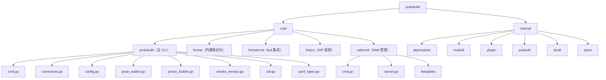

# protobuild

[](https://goreportcard.com/report/github.com/pubgo/protobuild)
[](LICENSE)

> 一个强大的 Protocol Buffers 构建和管理工具

## 特性

- 🚀 **统一构建** - 一条命令编译所有 proto 文件
- 📦 **多源依赖** - 支持 Go 模块、Git、HTTP、S3、GCS 和本地路径
- 🔌 **插件支持** - 灵活的 protoc 插件配置
- 🔍 **代码检查** - 内置基于 AIP 规则的 proto 文件检查
- 📝 **格式化** - 自动格式化 proto 文件
- ⚙️ **配置驱动** - 基于 YAML 的项目配置
- 📊 **进度显示** - 可视化进度条和详细错误信息
- 🗑️ **缓存管理** - 清理和管理依赖缓存
- 🌐 **Web 界面** - 可视化配置编辑器，支持 Proto 文件浏览
- 🏥 **环境诊断** - Doctor 命令检查开发环境配置
- 🎯 **项目初始化** - 快速项目设置，支持多种模板

## 安装

```bash
go install github.com/pubgo/protobuild@latest
```

## 快速开始

1. 在项目根目录创建 `protobuf.yaml` 配置文件：

```yaml
vendor: .proto
root:
  - proto
includes:
  - proto
deps:
  - name: google/protobuf
    url: github.com/protocolbuffers/protobuf
    path: src/google/protobuf
plugins:
  - name: go
    out: pkg
    opt:
      - paths=source_relative
```

2. 同步依赖：

```bash
protobuild vendor
```

3. 生成代码：

```bash
protobuild gen
```

## 命令说明

| 命令                    | 说明                                       |
| ----------------------- | ------------------------------------------ |
| `gen`                   | 编译 protobuf 文件                         |
| `vendor`                | 同步 proto 依赖到 vendor 目录              |
| `vendor -u`             | 强制重新下载所有依赖（忽略缓存）           |
| `deps`                  | 显示依赖列表及状态                         |
| `install`               | 安装 protoc 插件                           |
| `lint`                  | 使用 AIP 规则检查 proto 文件               |
| `format`                | 使用 buf 格式化 proto 文件                 |
| `format -w`             | 格式化并写入文件                           |
| `format --diff`         | 显示格式化差异                             |
| `format --exit-code`    | 需要格式化时返回错误码（CI 适用）          |
| `format --builtin`      | 使用内置格式化器                           |
| `format --clang-format` | 使用 clang-format 进行格式化               |
| `format --clang-style`  | 指定 clang-format 样式（如 file、google）  |
| `web`                   | 启动 Web 配置管理界面                      |
| `web --port 9090`       | 指定端口启动 Web 界面                      |
| `clean`                 | 清理依赖缓存                               |
| `clean --dry-run`       | 预览将被清理的内容                         |
| `init`                  | 初始化新的 protobuild 项目                 |
| `init --template grpc`  | 使用指定模板初始化（basic、grpc、minimal） |
| `doctor`                | 检查开发环境和依赖配置                     |
| `doctor --fix`          | 自动安装缺失的 Go 插件                     |
| `version`               | 显示版本信息                               |

## 配置说明

### 配置文件结构

```yaml
# 校验和，用于追踪变更（自动生成）
checksum: ""

# proto 依赖的 vendor 目录
vendor: .proto

# 基础插件配置（应用于所有插件）
base:
  out: pkg
  paths: source_relative
  module: github.com/your/module

# proto 源文件目录
root:
  - proto
  - api

# protoc 的 include 路径
includes:
  - proto
  - .proto

# 排除的路径
excludes:
  - proto/internal

# proto 依赖配置
deps:
  - name: google/protobuf
    url: github.com/protocolbuffers/protobuf
    path: src/google/protobuf
    version: v21.0
    optional: false

# protoc 插件配置
plugins:
  - name: go
    out: pkg
    opt:
      - paths=source_relative
  - name: go-grpc
    out: pkg
    opt:
      - paths=source_relative

# 插件安装器（go install）
installers:
  - google.golang.org/protobuf/cmd/protoc-gen-go@latest
  - google.golang.org/grpc/cmd/protoc-gen-go-grpc@latest

# 检查器配置
linter:
  rules:
    enabled_rules:
      - core::0131::http-method
    disabled_rules:
      - all
  format_type: yaml
```

### 插件配置

每个插件支持以下选项：

| 字段           | 类型        | 说明                               |
| -------------- | ----------- | ---------------------------------- |
| `name`         | string      | 插件名称（用作 protoc-gen-{name}） |
| `path`         | string      | 自定义插件二进制路径               |
| `out`          | string      | 输出目录                           |
| `opt`          | string/list | 插件选项                           |
| `shell`        | string      | 通过 shell 命令运行                |
| `docker`       | string      | 通过 Docker 容器运行               |
| `skip_base`    | bool        | 跳过基础配置                       |
| `skip_run`     | bool        | 跳过此插件                         |
| `exclude_opts` | list        | 排除的选项                         |

### 依赖配置

| 字段       | 类型   | 说明                                                                     |
| ---------- | ------ | ------------------------------------------------------------------------ |
| `name`     | string | vendor 目录中的本地名称/路径                                             |
| `url`      | string | 源 URL（Go 模块、Git URL、HTTP 归档、S3、GCS 或本地路径）                |
| `path`     | string | 源内的子目录                                                             |
| `version`  | string | 指定版本（用于 Go 模块）                                                 |
| `ref`      | string | Git 引用（分支、标签、提交）用于 Git 源                                  |
| `source`   | string | 源类型：`gomod`、`git`、`http`、`s3`、`gcs`、`local`（未指定时自动检测） |
| `optional` | bool   | 找不到时跳过                                                             |

#### 支持的依赖源

```yaml
deps:
  # Go 模块（默认）
  - name: google/protobuf
    url: github.com/protocolbuffers/protobuf
    path: src/google/protobuf

  # Git 仓库
  - name: googleapis
    url: https://github.com/googleapis/googleapis.git
    ref: master

  # HTTP 归档
  - name: envoy
    url: https://github.com/envoyproxy/envoy/archive/v1.28.0.tar.gz
    path: api

  # 本地路径
  - name: local-protos
    url: ./third_party/protos

  # S3 存储桶
  - name: internal-protos
    url: s3://my-bucket/protos.tar.gz

  # GCS 存储桶
  - name: shared-protos
    url: gs://my-bucket/protos.tar.gz
```

## 使用示例

### 使用自定义配置文件

```bash
protobuild -c protobuf.custom.yaml gen
```

### 检查 Proto 文件

```bash
protobuild lint
protobuild lint --list-rules  # 显示可用规则
protobuild lint --debug       # 调试模式
```

### 格式化 Proto 文件

```bash
# 格式化并预览变更（不写入文件）
protobuild format

# 格式化并写入文件
protobuild format -w

# 显示格式化差异
protobuild format --diff

# 如果文件需要格式化则返回错误码（适用于 CI）
protobuild format --exit-code

# 使用内置格式化器而非 buf
protobuild format --builtin

# 使用 clang-format（默认 style=file）
protobuild format --clang-format -w

# 使用 clang-format 并指定 style
protobuild format --clang-format --clang-style google -w

# 格式化指定目录
protobuild format -w proto/ api/
```

### Web 配置管理界面

```bash
# 在默认端口 (8080) 启动 Web 界面
protobuild web

# 在指定端口启动 Web 界面
protobuild web --port 9090
```

Web 界面提供：
- 📝 可视化配置编辑器
- 📦 依赖管理
- 🔌 插件配置
- 🚀 一键执行构建、检查、格式化等操作
- 📄 实时 YAML 配置预览
- 📊 项目统计仪表盘
- 🔍 Proto 文件浏览器（支持语法高亮）
- 📚 配置示例参考

### 初始化新项目

```bash
# 交互式初始化
protobuild init

# 使用指定模板
protobuild init --template basic    # 基础 Go + gRPC 项目
protobuild init --template grpc     # 完整 gRPC-Gateway 项目
protobuild init --template minimal  # 最小化配置

# 指定输出目录
protobuild init -o ./my-project
```

### 检查开发环境

```bash
# 诊断环境问题
protobuild doctor

# 自动安装缺失的 Go 插件
protobuild doctor --fix
```

输出示例：
```
🏥 Protobuild Doctor

  正在检查开发环境...

  ✅ protoc                 已安装 (v25.1)
  ✅ protoc-gen-go          已安装
  ✅ protoc-gen-go-grpc     已安装
  ✅ buf                    已安装 (v1.28.1)
  ✅ api-linter             已安装
  ✅ go                     已安装 (go1.21.5)
  ✅ 配置文件               已找到 protobuf.yaml
  ⚠️  Vendor 目录            未找到（请运行 'protobuild vendor'）

  ✅ 环境检查通过！
```

### 强制更新 Vendor

```bash
protobuild vendor -f      # 强制更新，即使没有检测到变更
protobuild vendor -u      # 重新下载所有依赖（忽略缓存）
```

### 显示依赖状态

```bash
protobuild deps
```

输出示例：
```
📦 Dependencies:

  NAME                                SOURCE     VERSION      STATUS
  ----                                ------     -------      ------
  google/protobuf                     Go Module  v21.0        🟢 cached
  googleapis                          Git        master       ⚪ not cached

  Total: 2 dependencies
```

### 清理依赖缓存

```bash
protobuild clean           # 清理所有缓存的依赖
protobuild clean --dry-run # 预览将被清理的内容
```

### 安装插件

```bash
protobuild install
protobuild install -f  # 强制重新安装
```

## 目录级配置

你可以在任何 proto 目录中放置 `protobuf.plugin.yaml` 文件，以覆盖该目录及其子目录的根配置。

```yaml
# proto/api/protobuf.plugin.yaml
plugins:
  - name: go
    out: pkg/api
    opt:
      - paths=source_relative
```

## 支持的 Protoc 插件

- `google.golang.org/protobuf/cmd/protoc-gen-go@latest`
- `google.golang.org/grpc/cmd/protoc-gen-go-grpc@latest`
- `github.com/grpc-ecosystem/grpc-gateway/v2/protoc-gen-grpc-gateway@latest`
- `github.com/grpc-ecosystem/grpc-gateway/v2/protoc-gen-openapiv2@latest`
- `github.com/pseudomuto/protoc-gen-doc/cmd/protoc-gen-doc@latest`
- `github.com/bufbuild/protoc-gen-validate/cmd/protoc-gen-validate@latest`
- 以及更多...

## 错误处理

当依赖解析失败时，protobuild 会提供详细的错误信息和建议：

```
❌ Failed to download dependency: google/protobuf
   Source:  Git
   URL:     git::https://github.com/protocolbuffers/protobuf.git?ref=v99.0
   Ref:     v99.0
   Error:   reference not found

💡 Suggestions:
   • 检查仓库 URL 是否正确且可访问
   • 验证 ref（标签/分支/提交）是否存在
   • 确保您有正确的身份验证（SSH 密钥或令牌）
```

## 缓存位置

依赖缓存在：
- **macOS/Linux**: `~/.cache/protobuild/deps/`
- **Go 模块**: 标准 Go 模块缓存 (`$GOPATH/pkg/mod`)

## 文档

- [配置示例](./docs/EXAMPLES.md) - 各种使用场景的详细配置示例
- [多源依赖设计](./docs/MULTI_SOURCE_DEPS.md) - 多源依赖解析设计文档
- [设计文档](./docs/DESIGN.md) - 架构和设计文档

## 路线图

以下是计划在未来版本中实现的功能：

| 功能                       | 描述                                     | 状态   |
| -------------------------- | ---------------------------------------- | ------ |
| 🔗 **依赖关系图**           | 可视化 proto 文件的 import 依赖关系      | 计划中 |
| ⚠️ **Breaking Change 检测** | 检测版本间的不兼容变更                   | 计划中 |
| 📚 **API 文档生成**         | 从 proto 注释自动生成 Markdown/HTML 文档 | 计划中 |
| 🎭 **Mock 服务器**          | 自动启动用于测试的 mock gRPC/HTTP 服务器 | 计划中 |
| 📝 **Proto 模板**           | 快速生成常用 proto 模式（CRUD、分页等）  | 计划中 |
| 📊 **字段统计分析**         | 分析字段命名规范和类型分布               | 计划中 |
| ✏️ **在线编辑器**           | 在 Web 界面直接编辑 proto 文件           | 计划中 |

## 项目架构


