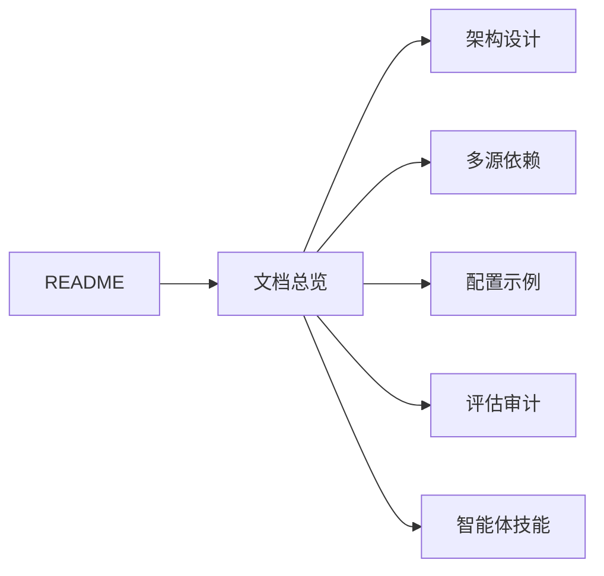
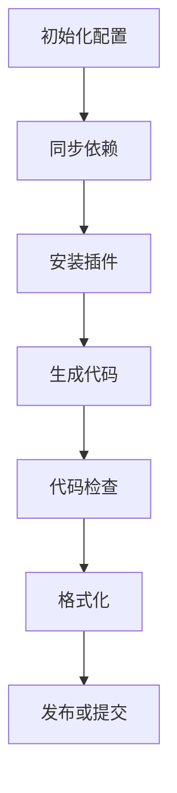
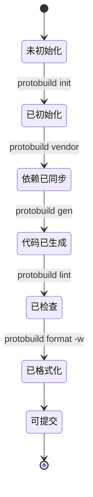
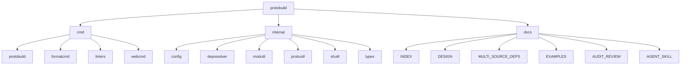

# protobuild

[](https://goreportcard.com/report/github.com/pubgo/protobuild)
[](LICENSE)

> 面向 `protobuf` 工程的构建与管理工具：依赖同步、代码生成、检查、格式化与可视化配置。

## 文档总览

请先阅读总览文档：[`docs/INDEX.md`](./docs/INDEX.md)



## 核心能力

- 统一构建：一条命令编译全部 `proto`
- 多源依赖：`gomod`、`git`、`http`、`s3`、`gcs`、`local`
- 配置驱动：基于 `protobuf.yaml`
- 代码检查：内置规则检查
- 格式化：支持 `buf`、内置格式化器与 `clang-format`
- 诊断与初始化：`doctor`、`init`
- 可视化管理：`web` 命令

## 典型工作流



## 命令状态图



## 安装

```bash
go install github.com/pubgo/protobuild@latest
```

## 快速开始

1. 创建配置文件 `protobuf.yaml`
2. 执行 `protobuild vendor`
3. 执行 `protobuild gen`

示例配置：

```yaml
vendor: .proto
root:
  - proto
includes:
  - proto
deps:
  - name: google/protobuf
    url: github.com/protocolbuffers/protobuf
    path: src/google/protobuf
plugins:
  - name: go
    out: pkg
    opt:
      - paths=source_relative
```

## 常用命令

| 命令                           | 说明               |
| ------------------------------ | ------------------ |
| `gen`                          | 生成代码           |
| `vendor`                       | 同步依赖           |
| `vendor -u`                    | 强制重新下载依赖   |
| `deps`                         | 查看依赖状态       |
| `install`                      | 安装插件           |
| `lint`                         | 检查规则           |
| `format`                       | 格式化             |
| `format -w`                    | 写回文件           |
| `web --port 9090`              | 启动可视化界面     |
| `clean --dry-run`              | 预览缓存清理       |
| `init --template grpc-gateway` | 使用模板初始化     |
| `doctor --fix`                 | 环境检查并尝试修复 |
| `skills`                       | 生成智能体技能模板 |
| `upgrade`                      | 自升级管理         |
| `version`                      | 版本信息           |

## 目录级配置覆盖

在子目录放置 `protobuf.plugin.yaml` 可覆盖根配置：

```yaml
plugins:
  - name: go
    out: pkg/api
    opt:
      - paths=source_relative
```

## 项目结构图



## 关联阅读

- [文档总览](./docs/INDEX.md)
- [架构设计](./docs/DESIGN.md)
- [多源依赖设计](./docs/MULTI_SOURCE_DEPS.md)
- [配置示例](./docs/EXAMPLES.md)
- [评估审计](./docs/AUDIT_REVIEW.md)
- [智能体技能指南](./docs/AGENT_SKILL.md)
