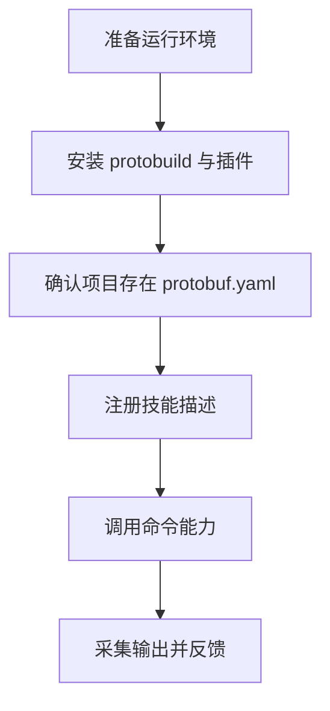
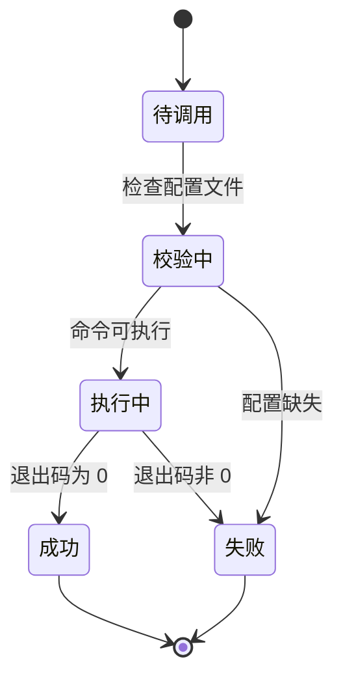

# 智能体技能接入指南

## 文档定位

本文件用于说明如何把 `protobuild` 作为智能体技能进行接入与调用。

- 上游文档：[`AUDIT_REVIEW.md`](./AUDIT_REVIEW.md)
- 总览入口：[`INDEX.md`](./INDEX.md)

## 接入流程图



## 技能执行状态图



## 技能描述示例

```yaml
schema_version: v1
name_for_human: Protobuild
name_for_model: protobuild
description_for_human: 用于管理、生成、检查与格式化 proto 工程
description_for_model: 执行 protobuild 命令完成依赖同步、代码生成、检查与格式化
version: 1.0.0
capabilities:
  categories: ["构建", "检查", "格式化"]
  mode: cli
```

## 命令能力示例

```yaml
tools:
  - name: protobuild_run
    description: 执行 protobuild 子命令
    input_schema:
      type: object
      properties:
        command:
          type: string
          enum: ["gen", "vendor", "lint", "format", "clean", "deps", "install", "doctor", "web"]
        args:
          type: array
          items: { type: string }
        working_dir:
          type: string
      required: ["command"]
```

## 推荐调用策略

1. 生成前先执行 `vendor`。
2. 写回型命令（如 `gen`、`format -w`）需提示用户文件会变化。
3. 持续集成场景优先用 `format --exit-code` 与 `lint`。
4. 命令失败时返回标准错误输出和修复建议。

## 最小操作清单

```bash
protobuild vendor
protobuild gen
protobuild lint
protobuild format --exit-code
```

## 关联阅读

- 项目入口：[`README.md`](../README.md)
- 架构设计：[`DESIGN.md`](./DESIGN.md)
- 配置示例：[`EXAMPLES.md`](./EXAMPLES.md)
