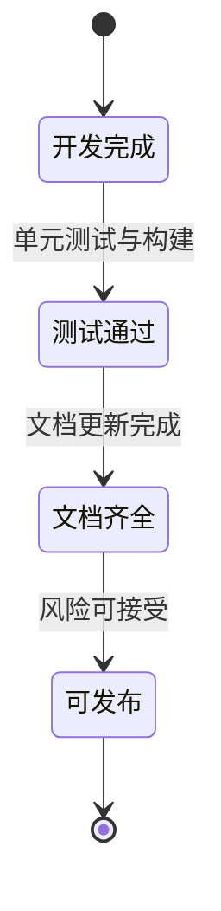

# 版本评估与审计文档

## 文档定位

本文件用于记录版本变更、质量状态、风险项与发布建议。

- 上游文档：[`EXAMPLES.md`](./EXAMPLES.md)
- 下游文档：[`AGENT_SKILL.md`](./AGENT_SKILL.md)
- 总览入口：[`INDEX.md`](./INDEX.md)

## 版本信息

- 分支：`feat/version1`
- 审计日期：`2026-01-21`
- 参考合并请求：`https://github.com/pubgo/protobuild/pull/19`

## 变更统计

| 指标     | 数值            |
| -------- | --------------- |
| 新增文件 | 6+              |
| 删除文件 | 40+             |
| 代码变更 | +1,186 / -9,661 |
| 净变化   | 约 -8,475       |

## 版本演进图

```mermaid
flowchart LR
  V0[旧版本]\n遗留插件较多 --> V1[版本一]\n多源依赖落地
  V1 --> V2[后续版本]\n并行与稳定性增强
```

## 核心成果

1. 完成多源依赖解析器。
2. 新增依赖查询与缓存清理命令。
3. 改进错误提示与进度展示。
4. 精简遗留代码，降低维护负担。

## 已完成功能清单

| 能力         | 状态   | 备注                               |
| ------------ | ------ | ---------------------------------- |
| 多源依赖     | 已完成 | 支持 `gomod/git/http/s3/gcs/local` |
| `deps` 命令  | 已完成 | 显示依赖状态                       |
| `clean` 命令 | 已完成 | 支持预览模式                       |
| 强制更新依赖 | 已完成 | `vendor -u`                        |
| 单元测试     | 已完成 | 核心包覆盖                         |

## 待改进项

| 事项         | 优先级 | 说明             |
| ------------ | ------ | ---------------- |
| 并行下载     | 高     | 缩短依赖同步耗时 |
| 缓存过期策略 | 高     | 提高缓存可控性   |
| 配置验证命令 | 中     | 提前发现配置错误 |
| 依赖树可视化 | 中     | 提升可观测性     |

## 发布状态图



## 风险评估

| 风险项               | 影响等级 | 建议               |
| -------------------- | -------- | ------------------ |
| 测试覆盖率仍可提升   | 中       | 增加集成测试       |
| 企业网络场景支持不足 | 中       | 增强代理配置说明   |
| 文档易漂移           | 中       | 建立文档一致性检查 |

## 结论

当前版本已经具备正式发布基础，建议在补齐关键测试与发布说明后进入发布流程。

## 关联阅读

- 架构设计：[`DESIGN.md`](./DESIGN.md)
- 依赖机制：[`MULTI_SOURCE_DEPS.md`](./MULTI_SOURCE_DEPS.md)
- 配置示例：[`EXAMPLES.md`](./EXAMPLES.md)
