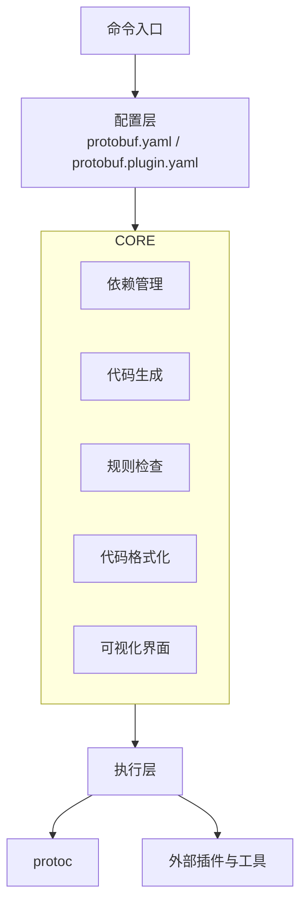
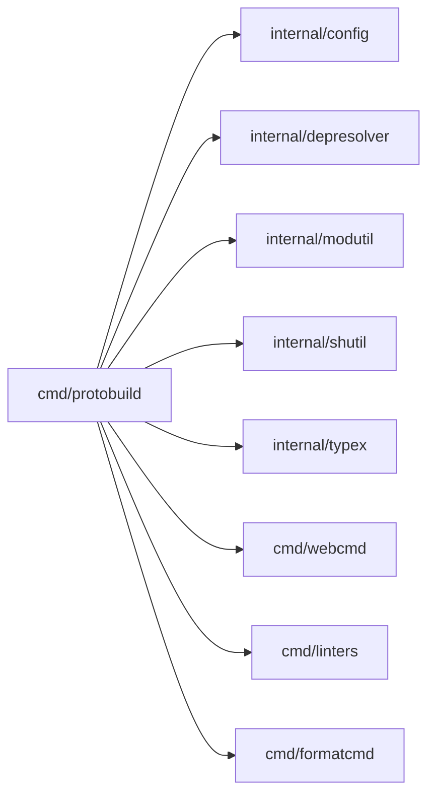
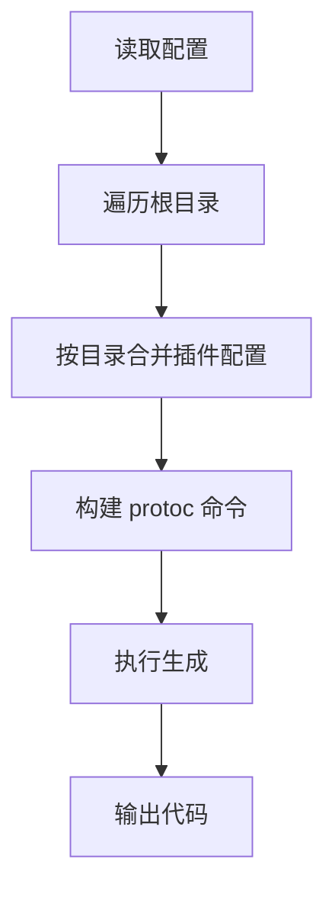
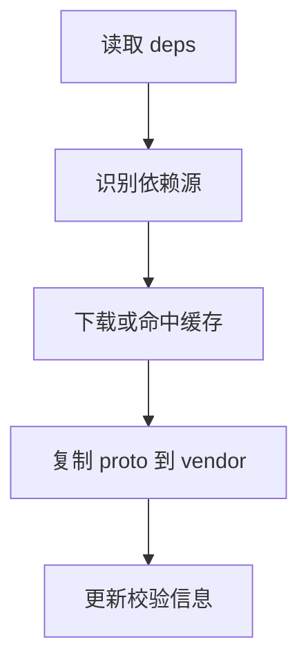
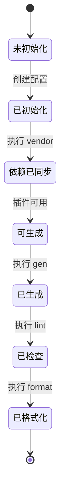

# 架构设计文档

## 文档定位

本文件说明系统架构、核心流程与运行状态。

- 上游文档：[`README.md`](../README.md)
- 下游文档：[`MULTI_SOURCE_DEPS.md`](./MULTI_SOURCE_DEPS.md)、[`EXAMPLES.md`](./EXAMPLES.md)
- 总览入口：[`INDEX.md`](./INDEX.md)

## 总体架构图

## 模块关系图

## 核心流程图

### 生成流程

### 依赖同步流程

## 生命周期状态图

## 设计要点

1. 配置分层：根配置负责全局默认，目录配置负责局部覆盖。
2. 依赖解耦：通过统一依赖管理层屏蔽不同依赖源差异。
3. 执行分离：命令解析、构建命令、执行命令分层处理。
4. 可观测性：关键操作提供进度与错误上下文。
5. 可扩展性：插件、依赖源、规则引擎均可演进。

## 关联阅读

- 依赖细节：[`MULTI_SOURCE_DEPS.md`](./MULTI_SOURCE_DEPS.md)
- 可用配置：[`EXAMPLES.md`](./EXAMPLES.md)
- 版本评估：[`AUDIT_REVIEW.md`](./AUDIT_REVIEW.md)
