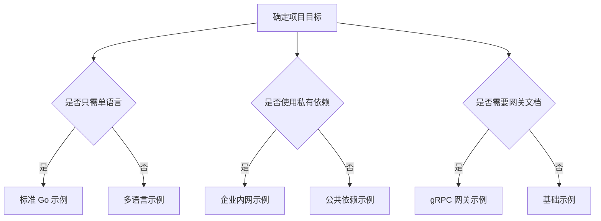
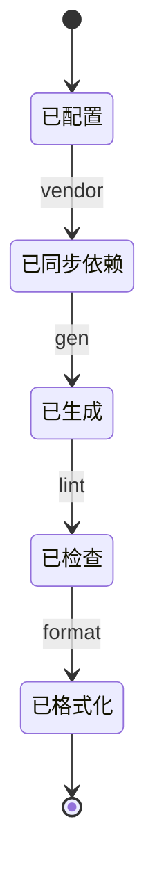

# 配置示例文档

## 文档定位

本文件提供可直接复用的配置模板与场景示例。

- 上游文档：[`MULTI_SOURCE_DEPS.md`](./MULTI_SOURCE_DEPS.md)
- 下游文档：[`AUDIT_REVIEW.md`](./AUDIT_REVIEW.md)
- 总览入口：[`INDEX.md`](./INDEX.md)

## 示例选择流程图



## 示例执行状态图



## 示例一：最小配置

```yaml
vendor: .proto
root:
  - proto
plugins:
  - name: go
    out: gen
```

## 示例二：标准 Go 项目

```yaml
vendor: .proto
root:
  - proto
includes:
  - proto
  - .proto
deps:
  - name: google/protobuf
    source: gomod
    url: github.com/protocolbuffers/protobuf
    path: src/google/protobuf
plugins:
  - name: go
    out: gen
    opt:
      - paths=source_relative
  - name: go-grpc
    out: gen
    opt:
      - paths=source_relative
installers:
  - google.golang.org/protobuf/cmd/protoc-gen-go@latest
  - google.golang.org/grpc/cmd/protoc-gen-go-grpc@latest
```

## 示例三：gRPC 网关项目

```yaml
vendor: .proto
root:
  - proto
includes:
  - proto
  - .proto
deps:
  - name: google/protobuf
    source: gomod
    url: github.com/protocolbuffers/protobuf
    path: src/google/protobuf
  - name: google/api
    source: gomod
    url: github.com/googleapis/googleapis
    path: google/api
plugins:
  - name: go
    out: gen/go
    opt: paths=source_relative
  - name: go-grpc
    out: gen/go
    opt: paths=source_relative
  - name: grpc-gateway
    out: gen/go
    opt:
      - paths=source_relative
      - generate_unbound_methods=true
  - name: openapiv2
    out: docs/swagger
installers:
  - google.golang.org/protobuf/cmd/protoc-gen-go@latest
  - google.golang.org/grpc/cmd/protoc-gen-go-grpc@latest
  - github.com/grpc-ecosystem/grpc-gateway/v2/protoc-gen-grpc-gateway@latest
  - github.com/grpc-ecosystem/grpc-gateway/v2/protoc-gen-openapiv2@latest
```

## 示例四：企业私有依赖

```yaml
vendor: .proto
root:
  - api
includes:
  - api
  - .proto
deps:
  - name: google/protobuf
    source: gomod
    url: github.com/protocolbuffers/protobuf
    path: src/google/protobuf
  - name: internal/common
    source: git
    url: git@gitlab.company.com:platform/proto-common.git
    ref: v2.0.0
    path: common
  - name: internal/models
    source: s3
    url: s3://company-artifacts/protos/models-v1.2.0.tar.gz
plugins:
  - name: go
    out: pkg/pb
    opt: paths=source_relative
  - name: go-grpc
    out: pkg/pb
    opt: paths=source_relative
```

## 示例五：多语言输出

```yaml
vendor: .proto
root:
  - proto
includes:
  - proto
  - .proto
deps:
  - name: google/protobuf
    source: gomod
    url: github.com/protocolbuffers/protobuf
    path: src/google/protobuf
plugins:
  - name: go
    out: gen/go
    opt: paths=source_relative
  - name: go-grpc
    out: gen/go
    opt: paths=source_relative
  - name: python
    out: gen/python
  - name: grpc_python
    out: gen/python
```

## 检查器配置示例

```yaml
linter:
  rules:
    enabled_rules:
      - core::0131::http-method
      - core::0131::http-body
    disabled_rules:
      - all
  format_type: yaml
  ignore_comment_disables_flag: false
```

## 常见命令组合

```bash
protobuild vendor
protobuild gen
protobuild lint
protobuild format --exit-code
```

## 关联阅读

- 架构设计：[`DESIGN.md`](./DESIGN.md)
- 依赖机制：[`MULTI_SOURCE_DEPS.md`](./MULTI_SOURCE_DEPS.md)
- 版本评估：[`AUDIT_REVIEW.md`](./AUDIT_REVIEW.md)
