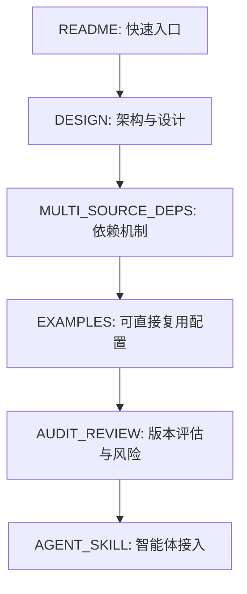
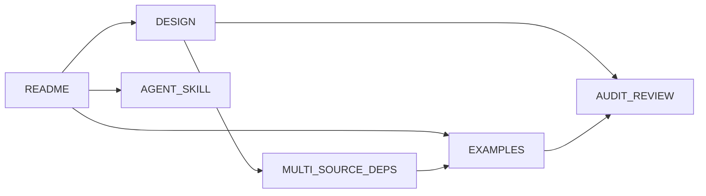
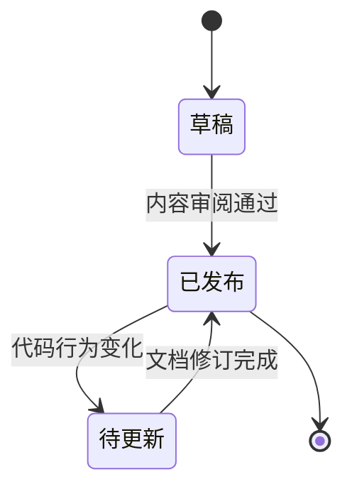

# 文档总览

本文档用于串联项目全部核心文档，确保阅读顺序清晰、职责边界明确。

## 阅读路径

## 文档职责图

## 文档清单

| 文档                                             | 作用                         | 建议阅读顺序 |
| ------------------------------------------------ | ---------------------------- | ------------ |
| [`README.md`](../README.md)                      | 项目入口、命令速览、上手流程 | 1            |
| [`DESIGN.md`](./DESIGN.md)                       | 系统架构、核心流程、状态模型 | 2            |
| [`MULTI_SOURCE_DEPS.md`](./MULTI_SOURCE_DEPS.md) | 多源依赖设计与实现约束       | 3            |
| [`EXAMPLES.md`](./EXAMPLES.md)                   | 配置模板与场景示例           | 4            |
| [`AUDIT_REVIEW.md`](./AUDIT_REVIEW.md)           | 版本审计、风险与改进建议     | 5            |
| [`AGENT_SKILL.md`](./AGENT_SKILL.md)             | 智能体接入与技能规范         | 6            |

## 维护状态图

