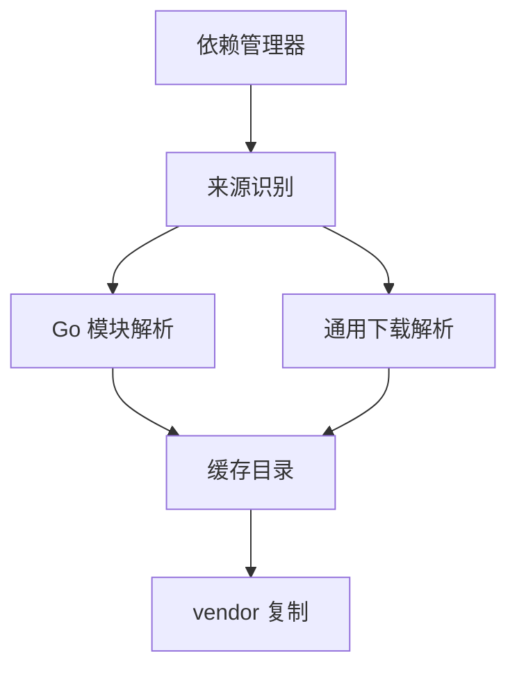
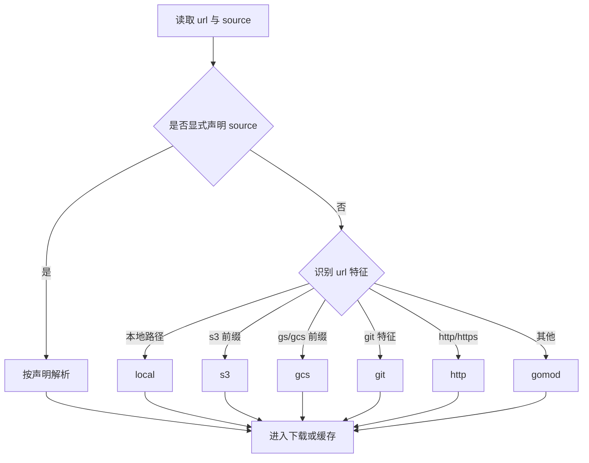
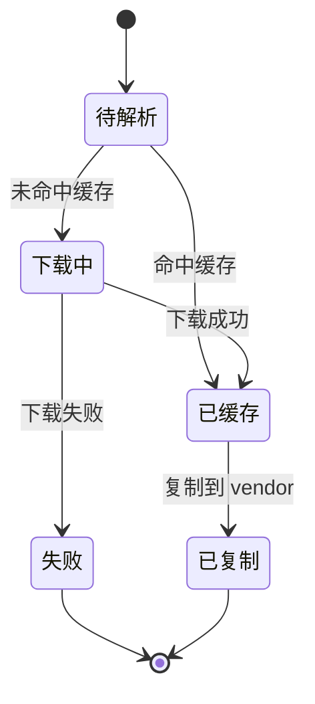

# 多源依赖设计文档

## 文档定位

本文件说明多源依赖的目标、实现边界和使用方式。

- 上游文档：[`DESIGN.md`](./DESIGN.md)
- 下游文档：[`EXAMPLES.md`](./EXAMPLES.md)
- 总览入口：[`INDEX.md`](./INDEX.md)

## 目标与范围

目标：在同一配置模型下，支持多种依赖来源并统一缓存与复制流程。

当前版本支持的依赖源：

- `gomod`
- `git`
- `http`
- `s3`
- `gcs`
- `local`

> 说明：当前版本不支持 `buf` 作为依赖源。

## 依赖解析架构图



## 自动识别流程图



## 依赖状态图



## 配置字段

```yaml
deps:
  - name: google/protobuf
    source: gomod
    url: github.com/protocolbuffers/protobuf
    path: src/google/protobuf
    version: v25.0
    ref: ""
    optional: false
```

字段说明：

| 字段       | 说明                       |
| ---------- | -------------------------- |
| `name`     | 复制到 `vendor` 后的目录名 |
| `source`   | 依赖来源类型               |
| `url`      | 依赖地址                   |
| `path`     | 依赖中的子路径             |
| `version`  | 版本（主要用于 `gomod`）   |
| `ref`      | 引用（主要用于 `git`）     |
| `optional` | 可选依赖，失败时可跳过     |

## 场景示例

### Go 模块源

```yaml
deps:
  - name: google/api
    source: gomod
    url: github.com/googleapis/googleapis
    path: google/api
```

### Git 源

```yaml
deps:
  - name: googleapis
    source: git
    url: https://github.com/googleapis/googleapis.git
    ref: master
    path: google
```

### HTTP 源

```yaml
deps:
  - name: envoy
    source: http
    url: https://github.com/envoyproxy/envoy/archive/v1.28.0.tar.gz
    path: api
```

### 对象存储源

```yaml
deps:
  - name: internal-protos
    source: s3
    url: s3://my-bucket/protos.tar.gz

  - name: shared-protos
    source: gcs
    url: gs://my-bucket/protos.tar.gz
```

### 本地路径源

```yaml
deps:
  - name: local-protos
    source: local
    url: ./third_party/protos
```

## 实施建议

1. 尽量显式声明 `source`，减少歧义。
2. 对关键依赖锁定 `version` 或 `ref`。
3. CI 场景使用 `vendor -u` 定期验证可重复性。
4. 对私有源配置凭证与网络代理策略。

## 关联阅读

- 架构总览：[`DESIGN.md`](./DESIGN.md)
- 可复用配置：[`EXAMPLES.md`](./EXAMPLES.md)
- 版本评估：[`AUDIT_REVIEW.md`](./AUDIT_REVIEW.md)
