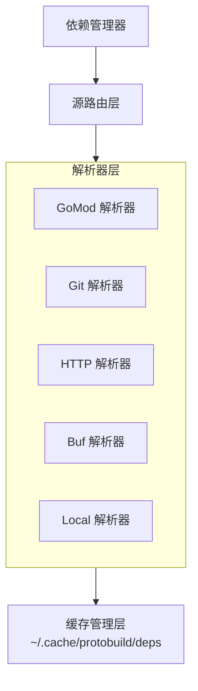
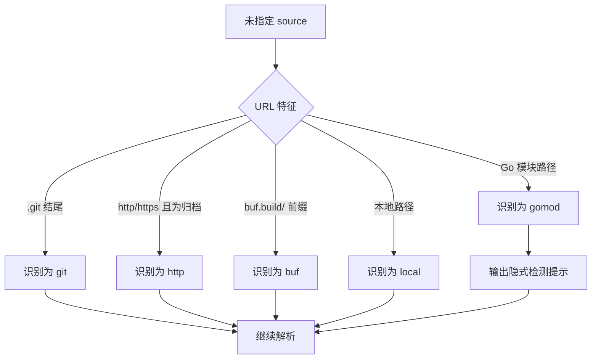

# 多源依赖设计

## 问题背景

当前实现对 Go 模块依赖较重，主要体现在：

- 使用 `go mod graph` 解析版本
- 使用 `go get` 下载依赖
- 依赖内容主要位于 `$GOPATH/pkg/mod`

这会导致非 Go 项目（如 Python、Java、JavaScript）接入成本变高。

## 设计目标

实现统一的多源依赖解析能力，使不同语言项目都能使用同一套依赖拉取和缓存流程。

## 配置结构

```yaml
deps:
  # 源类型：gomod（默认，向后兼容）
  - name: google/api
    source: gomod
    url: github.com/googleapis/googleapis
    path: google/api
    version: v0.0.0-20230822172742-b8732ec3820d

  # 源类型：git
  - name: google/protobuf
    source: git
    url: https://github.com/protocolbuffers/protobuf.git
    path: src/google/protobuf
    ref: v21.0           # 标签、分支或提交
    depth: 1             # 浅克隆深度（可选）

  # 源类型：http（tar.gz、zip）
  - name: envoy/api
    source: http
    url: https://github.com/envoyproxy/envoy/archive/refs/tags/v1.25.0.tar.gz
    path: api/envoy
    strip: 1             # 去掉归档前导目录层级

  # 源类型：buf（Buf Schema Registry）
  - name: buf/validate
    source: buf
    url: buf.build/bufbuild/protovalidate
    version: v0.5.0

  # 源类型：local（本地路径）
  - name: local/proto
    source: local
    url: /path/to/proto
```

## 架构设计



## 实现计划

### 阶段一：抽象层

```go
// internal/depresolver/resolver.go

type Source string

const (
    SourceGoMod Source = "gomod"
    SourceGit   Source = "git"
    SourceHTTP  Source = "http"
    SourceBuf   Source = "buf"
    SourceLocal Source = "local"
)

type Dependency struct {
    Name     string `yaml:"name"`
    Source   Source `yaml:"source,omitempty"`   // 默认自动检测或 gomod
    URL      string `yaml:"url"`
    Path     string `yaml:"path,omitempty"`
    Version  string `yaml:"version,omitempty"`
    Ref      string `yaml:"ref,omitempty"`      // git 用
    Depth    int    `yaml:"depth,omitempty"`    // git 用
    Strip    int    `yaml:"strip,omitempty"`    // 归档解压用
    Optional bool   `yaml:"optional,omitempty"`
}

type Resolver interface {
    // 解析依赖并返回本地路径
    Resolve(dep *Dependency) (string, error)

    // 判断是否支持该依赖
    Supports(dep *Dependency) bool
}

type ResolverChain struct {
    resolvers []Resolver
    cache     *CacheManager
}

func (r *ResolverChain) Resolve(dep *Dependency) (string, error) {
    for _, resolver := range r.resolvers {
        if resolver.Supports(dep) {
            return resolver.Resolve(dep)
        }
    }
    return "", fmt.Errorf("no resolver found for source: %s", dep.Source)
}
```

### 阶段二：各源解析器

统一下载能力使用 [hashicorp/go-getter](https://github.com/hashicorp/go-getter)：

- Git：通过 `git::` 前缀和 `?ref=` 指定版本
- HTTP：自动识别并解压归档（tar.gz、zip 等）
- S3：支持 `s3://` 或 `s3::` 前缀
- GCS：支持 `gcs://` 或 `gs://` 前缀

```go
// Git 示例
// url: git::https://github.com/protocolbuffers/protobuf.git?ref=v21.0

// S3 示例
// url: s3://bucket-name/path/to/proto.tar.gz

// HTTP 示例（自动解压）
// url: https://github.com/user/repo/archive/v1.0.0.tar.gz
```

Go 模块解析器保持现有机制，继续使用 `go mod download` 与 Go 模块缓存。

Buf 解析器示例：

```go
type BufResolver struct {
    cacheDir string
}

func (r *BufResolver) Resolve(dep *Dependency) (string, error) {
    // 使用 buf CLI 导出到缓存目录
    cmd := exec.Command("buf", "export", dep.URL, "-o", cachePath)
    // ...
}
```

### 阶段三：缓存管理

```go
type CacheManager struct {
    baseDir string // ~/.cache/protobuild
}

func (c *CacheManager) GetPath(source Source, key string) string {
    return filepath.Join(c.baseDir, string(source), hashString(key))
}

func (c *CacheManager) Clean() error {
    return os.RemoveAll(c.baseDir)
}
```

## 迁移策略

1. 向后兼容（未指定 `source` 时自动检测）：
   - URL 看起来像 Go 模块路径：使用 `gomod`
   - URL 以 `.git` 结尾：使用 `git`
   - URL 以 `http://` 或 `https://` 开头且为归档：使用 `http`
   - URL 以 `buf.build/` 开头：使用 `buf`
   - URL 是本地路径：使用 `local`

2. 弃用提示：
   - 对隐式 `gomod` 检测输出提示，建议显式声明 `source`

自动检测流程如下：



## 方案收益

1. 语言无关：可用于 Go 之外的项目
2. 场景灵活：按需选择依赖来源
3. 缓存统一：便于清理、复用和排障
4. 向后兼容：历史配置可继续使用
5. 便于扩展：后续可增加更多源类型

## 配置示例

### Python 项目

```yaml
vendor: .proto
deps:
  - name: google/protobuf
    source: git
    url: https://github.com/protocolbuffers/protobuf.git
    ref: v21.0
    path: src/google/protobuf

  - name: googleapis
    source: git
    url: https://github.com/googleapis/googleapis.git
    ref: master
    path: google
```

### TypeScript 项目

```yaml
vendor: proto
deps:
  - name: validate
    source: buf
    url: buf.build/bufbuild/protovalidate

  - name: google/api
    source: http
    url: https://github.com/googleapis/googleapis/archive/master.tar.gz
    strip: 1
    path: google/api
```

### Go 项目（兼容当前行为）

```yaml
vendor: .proto
deps:
  - name: google/api
    url: github.com/googleapis/googleapis
    path: google/api
    # source: gomod（隐式）
```
